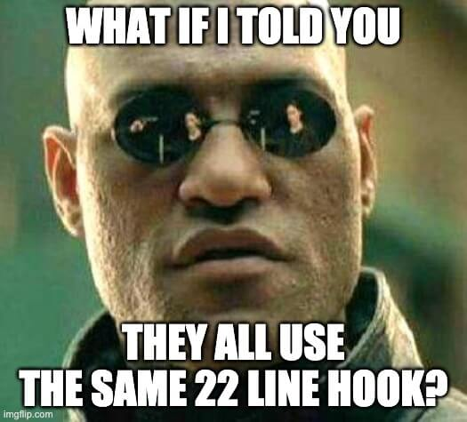

import 'style-loader!css-loader!codemirror/lib/codemirror.css'
import 'style-loader!css-loader!./cm-night-owl.css'
import 'style-loader!css-loader!./styles.css'
import 'codemirror/mode/javascript/javascript'
import 'codemirror/mode/jsx/jsx'
import './script.js'
import {Appear, Notes} from 'mdx-deck'
import {FirstSlide} from './components/first-slide'
import {AboutMe} from './components/about-me'
import * as Accordions from './components/accordion/implementations'
import * as Tabs from './components/tabs/implementations'
import {CodeBlock} from './components/code-block'
import WhiteLayout from './components/white-layout'
import {aprocalypse} from './components/aprocalypse'
import {accordionCode} from './components/accordion-code'
import {Sobbing, Sob} from './components/sob'
import {RandomlyPlaced} from './components/randomly-placed'
import {DemoSlide} from './components/demo-slide'
import DemoLayout from './components/demo-layout'
import {Resources} from './components/resources'

export {default as theme} from './theme'

export default WhiteLayout

<FirstSlide
  title="Simply React ⚛️"
  subtitle="Why I love React Patterns so much"
/>

---

export default WhiteLayout

# Please Stand

_If you are physically able ❤️ ♿️_


---

export default WhiteLayout

# What this talk is

- Typical lifecycle of a component <br /><small>(not what you're thinking)</small>
- How patterns can simplify
- Composability
- A challenge


---

export default WhiteLayout

# What this talk is *not*

<div style={{fontSize: 40, textAlign: 'left'}}>
  <ul>
    <li><strong>How</strong> to implement patterns</li>
      <Appear>
        <li><a href="https://github.com/kentcdodds/react-testing-library">react-testing-library</a></li>
        <li><a href="https://github.com/kentcdodds/downshift">downshift</a></li>
        <li><a href="https://github.com/kentcdodds/babel-plugin-macros">babel-plugin-macros</a></li>
        <li>
          <del>
            <a href="https://github.com/paypal/glamorous/issues/419">glamorous</a>
          </del>{' '}
          <a href="https://emotion.sh">emotion</a>
        </li>
      </Appear>
  </ul>
</div>


---

# Let's get started


---

export default DemoLayout

<DemoSlide
  code={`<Accordion items={accordionItems} />`}
  accordion={<Accordions.Standard />}
/>
<Appear>
  <div>
    <div
      style={{
        fontSize: '0.8em',
        position: 'absolute',
        bottom: 50,
        left: 0,
        width: '100vw',
        textAlign: 'center',
        borderRadius: 6,
        padding: 4,
        backgroundColor: 'rgba(1,22,39, 0.6)',
      }}
    >
      <div>Theme: Night Owl by Sarah Drasner</div>
      <div>Font: Dank Mono by Phil Plückthun</div>
    </div>
  </div>
  <div />
</Appear>

```notes
- Following the lifecycle of an Accordion
- Make it for your use case
- Props API is pretty simple
- Theme/Font shoutout
- New Use Case: Above
```

---

export default DemoLayout

<DemoSlide
  code={`<Accordion items={accordionItems} above={true} />`}
  accordion={<Accordions.Above />}
/>

```notes
- Just a few conditional statements (position, hand, animation)
- New Use Case: Right
```

---

export default DemoLayout

<DemoSlide
  code={`<Accordion items={accordionItems} right={true} />`}
  accordion={<Accordions.Right />}
/>

```notes
- Refactor to use CSS Grid and use gridAutoFlow for column vs row
- New Use Case: Left
```

---

export default DemoLayout

<DemoSlide
  code={`<Accordion items={accordionItems} left={true} />`}
  accordion={<Accordions.Left />}
  followCode={`<Accordion items={accordionItems} position="left" />`}
/>

```notes
- Refactor the props to use position because David K. Piano said impossible states is a no-no
- New Use Case: Single
```

---

export default DemoLayout

<DemoSlide
  code={`
<Accordion
  items={accordionItems}
  position="bottom"
  single={true}
/>
  `}
  accordion={<Accordions.Single />}
/>

```notes
- Some conditional logic in the click handler
- New Use Case: Prevent Close
```

---

export default DemoLayout

<DemoSlide
  code={`
<Accordion
  items={accordionItems}
  position="bottom"
  preventClose={true}
/>
  `}
  accordion={<Accordions.PreventClose />}
/>

```notes
- Some additional conditional logic in the click handler
- New Use Case: SinglePreventClose
```

---

export default DemoLayout

<DemoSlide
  code={`
<Accordion
  items={accordionItems}
  position="bottom"
  single={true}
  preventClose={true}
/>
  `}
  accordion={<Accordions.SinglePreventClose />}
/>

```notes
- Luckily no changes necessary!
- But this looks familiar! New Use Case: Tabs
```

---

export default DemoLayout

<DemoSlide
  code={`
<Accordion
  items={accordionItems}
  position="bottom"
  single={true}
  preventClose={true}
  tabs={true}
/>
  `}
  accordion={<Tabs.Standard />}
/>

<Appear>
  <div />
  <div />
  
</Appear>

```notes
- Write tabs UI in a different method `renderTabs`
- Cry!
- New Use Case: Tabs Above
```

---

export default DemoLayout

<DemoSlide
  code={`<Tabs items={tabItems} position="top" />`}
  accordion={<Tabs.Above />}
/>

<Appear>
  <div />
  <div />
  
</Appear>

```notes
- I don't want to maintain this anymore
- Fork the component to make a tabs component
- Sob
```

---

<CodeBlock>{aprocalypse}</CodeBlock>

<Sobbing />

```notes
- Datepicker with 60 props
- "Configuration Props" (objects with dozens of options, basically just more props)
- "render" props: boolean props to control whether something is rendered
- Bundle: Code you don't need
- Maintenance: Documentation, answering questions
- Implementation: Remembering use cases and not breaking things. Contributors.
- API: Having to learn the growing API
- APROPCALYPSE
```

---



```notes
(notes for next slide...)
- I might have manually changed the code post-prettier :)
- Don't worry about the specific implementation details.
- Two major patterns that allow this:
  - stateReducer
  - render props
- Inversion of control patterns
```

---

export default ({children}) => <div style={{overflow: 'scroll'}}>{children}</div>

<CodeBlock style={{fontSize: 14}}>{accordionCode}</CodeBlock>

<!--
  cannot have notes on this slide for some reason...
  There's an infinite loop in React code and a warning
  in the console about history...
-->

---

# Demo

[Codesandbox](https://codesandbox.io/s/1qo7rylm14)

<small>Thank you Ives ❣️</small>

```notes
- Composition allows for the same simple API
```

---

# Resources

<Resources />


```notes
- Advanced course available on Egghead.io and Frontend Masters
```

---

# A word of caution

What if this is all you will ever need?

<div
  style={{
    position: 'relative',
    height: 400,
    width: 400,
    margin: 'auto',
  }}
>
  <div style={{position: 'absolute'}}>
    <Accordions.Standard />
  </div>
</div>

---

# YAGNI

<small>You Ain't Gonna Need It</small>
<Appear>
  <div>
    <strong style={{fontSize: '2em'}}>Optimize for deletability</strong>
  </div>
  <div>
    <video style={{display: 'block', maxWidth: '100%', margin: 'auto'}} autoPlay playsInline loop muted src="public/erased-from-existence.mp4" />
  </div>
</Appear>

```notes
- Be mindful and intentional
- Measure the costs and the benefits.
- Just go with what you have and see how it plays out.
- Optimize for deletability
- Erased from existence!
```

---

export default WhiteLayout


<div><strong style={{letterSpacing: 1.5}}>LISTEN TO MICHAEL</strong></div>

---

# Use patterns that _simplify_ your API

<Appear>
  <div>
    <RandomlyPlaced
      style={{
        transform: 'rotate(20deg)',
        top: '30%',
        left: '20%'
      }}
    >
      state reducers
    </RandomlyPlaced>
  </div>
  <div>
    <RandomlyPlaced
      style={{
        transform: 'rotate(30deg)',
        bottom: '10%',
        left: '10%'
      }}
    >
      control props
    </RandomlyPlaced>
  </div>
  <div>
    <RandomlyPlaced
      style={{
        transform: 'rotate(10deg)',
        bottom: '30%',
        right: '20%'
      }}
    >
      providers
    </RandomlyPlaced>
  </div>
  <div>
    <RandomlyPlaced
      style={{
        transform: 'rotate(-10deg)',
        bottom: '10%',
        right: '30%'
      }}
    >
      compound components
    </RandomlyPlaced>
  </div>
  <div>
    <RandomlyPlaced
      style={{
        transform: 'rotate(-20deg)',
        top: '10%',
        left: '60%'
      }}
    >
      render props
    </RandomlyPlaced>
  </div>
  <div>
    <RandomlyPlaced
      style={{
        top: 0,
        bottom: 0,
        left: 0,
        right: 0,
        fontWeight: 'bold',
        fontSize: '5rem',
        display: 'flex',
        justifyContent: 'center',
        alignItems: 'center',
      }}
    >
      Let's (re)discover more!
    </RandomlyPlaced>
  </div>
</Appear>

```notes
- Applying old principles (like composition and inversion of control)
```

---

# Thank You


[simply-react.netlify.com](https://simply-react.netlify.com)

 <a href="https://twitter.com/kentcdodds">@kentcdodds</a>
